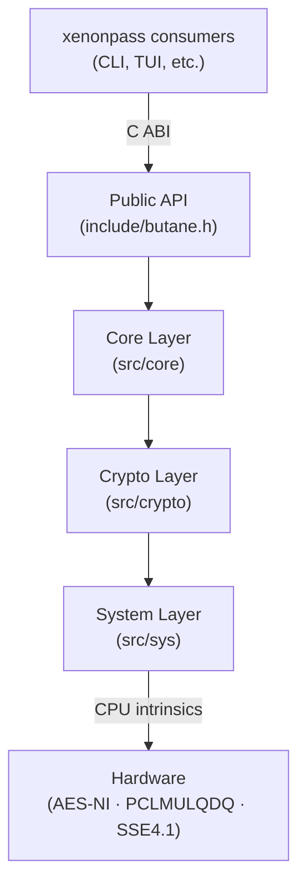
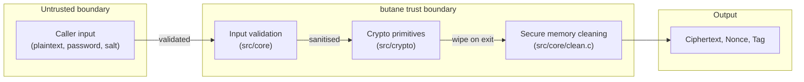
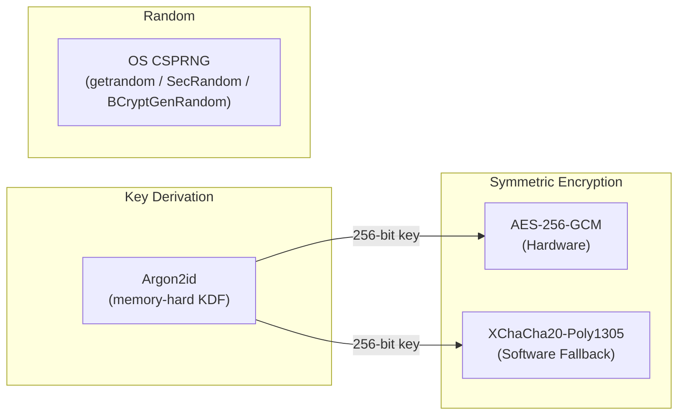
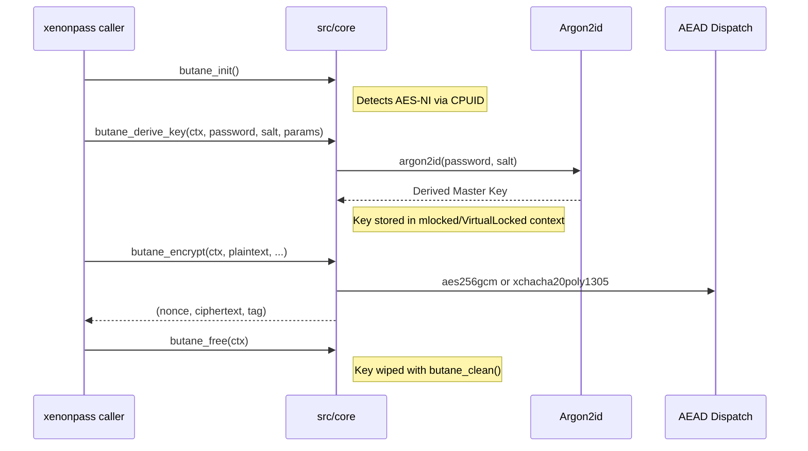
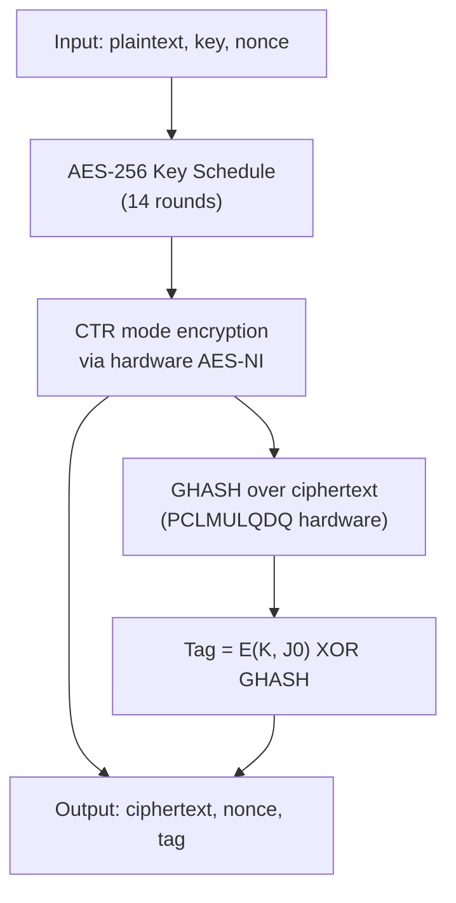
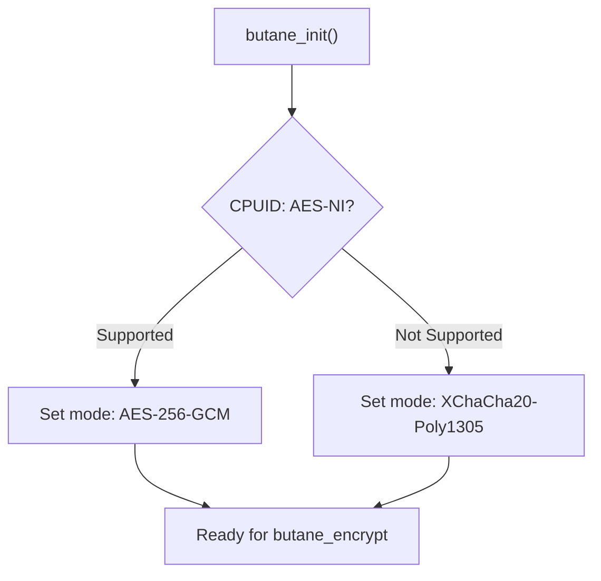

# Security Design — butane

> **butane** is the cryptographic engine powering [xenonpass](https://github.com/xenonpass/xenonpass). This document describes its security architecture, cryptographic primitives and its trust boundaries.

---

## Table of Contents

1. [Overview](#overview)
2. [Architecture](#architecture)
3. [Source Layout & Trust Layers](#source-layout--trust-layers)
4. [Cryptographic Primitives](#cryptographic-primitives)
5. [Key Derivation & Lifecycle](#key-derivation--lifecycle)
6. [Encryption Flow (Hybrid AEAD)](#encryption-flow-hybrid-aead)
7. [Hardware Acceleration & Fallbacks](#hardware-acceleration--fallbacks)
8. [Memory Safety](#memory-safety)
9. [Reporting Vulnerabilities](#reporting-vulnerabilities)

---

## Overview

butane is a pure-C cryptographic library compiled to a static archive (`libbutane.a` / `butane.lib`). It is designed with one principle above all else: **no cryptographic shortcuts**. The library exposes a minimal, opinionated API to higher-level xenonpass components, deliberately hiding algorithm selection from the user to ensure the most secure path is always taken.

```

    xenonpass (Frontend [CLI, TUI, WebServer, App, etc.])
        │
        ▼
    libbutane  ◄── this repository (xpass/butane)
        │
        ▼
    OS / Hardware (AES-NI, PCLMULQDQ, or fallback)

```

---

## Architecture

butane is layered. Each layer has a single responsibility and only calls downward.



**Layer responsibilities:**

| Layer | Path | Responsibility |
|---|---|---|
| Public API | `include/` | Stable ABI exposed to xenonpass |
| Core | `src/core/` | Context management, memory cleaning, and hardware detection |
| Crypto | `src/crypto/` | Algorithm implementations (`AES-GCM`, `Argon2id`, `XChaCha20-Poly1305`) |
| Sys | `src/sys/` | Hardware capability detection (cpuid) |

---

## Source Layout & Trust Layers



All data entering butane crosses the validation boundary first. Sensitive buffers—including the master key and salt stored in the context—are wiped using `butane_clean` before the context is freed.

---

## Cryptographic Primitives

butane automatically selects the best available primitive based on hardware support.



| Primitive | Algorithm | Reason |
|---|---|---|
| Primary AEAD | AES-256-GCM | Hardware-accelerated (AES-NI), constant-time on supported CPUs |
| Fallback AEAD | XChaCha20-Poly1305 | High-security software fallback for CPUs without AES-NI |
| KDF | Argon2id | Memory-hard protection against GPU brute-force attacks |
| Nonce generation | OS CSPRNG | Uses `getrandom` (Linux), `SecRandomCopyBytes` (Apple), or `BCryptGenRandom` (Windows) |

---

## Key Derivation & Lifecycle

Master passwords are stretched into 256-bit keys using Argon2id. Key material is stored within the `butane_ctx` and protected using `mlock` (Unix) or `VirtualLock` (Windows) to prevent swapping to disk.



---

## Encryption Flow (AES-256-GCM)

When AES-NI is available, butane uses a 14-round AES-256 implementation.



---

## Hardware Acceleration & Fallbacks

Unlike libraries that require manual configuration, butane performs runtime hardware detection. If `cpuid` indicates the processor lacks AES-NI support, butane transparently switches to XChaCha20-Poly1305.



This ensures the highest possible performance on modern systems while maintaining broad compatibility and security on older or alternative hardware.

---

## Memory Safety

butane prioritizes memory hygiene to prevent sensitive data leakage.

| Guarantee | Mechanism |
|---|---|--- |
| Anti-Swap Protection | Master keys and Argon2 work-buffers are locked in RAM via `mlock()` (Unix) or `VirtualLock()` (Windows) |
| Guaranteed Wiping | `butane_clean` uses `explicit_bzero`, `memset_s`, or `SecureZeroMemory` (Windows) to prevent compiler optimization |
| Context Isolation | Sensitive state is encapsulated in `butane_ctx`; internal structures are cleaned on `butane_free` |
| Standard Compliance | Compiled with `-Wall -Wextra -Wpedantic` and `-std=c11` |

---

## Reporting Vulnerabilities

If you discover a security issue in butane, **do not open a public GitHub issue.**

Please report it privately to the xenonpass maintainers:

- Open a [GitHub Security Advisory](https://github.com/xenonpass/butane/security/advisories/new) on this repository.
- We aim to acknowledge reports within **48 hours** and provide a fix or mitigation within **10-12 days** for critical issues.

---

*This document describes the intended security design of butane. Discrepancies between this document and the implementation should be treated as bugs — in either the code or the documentation.*